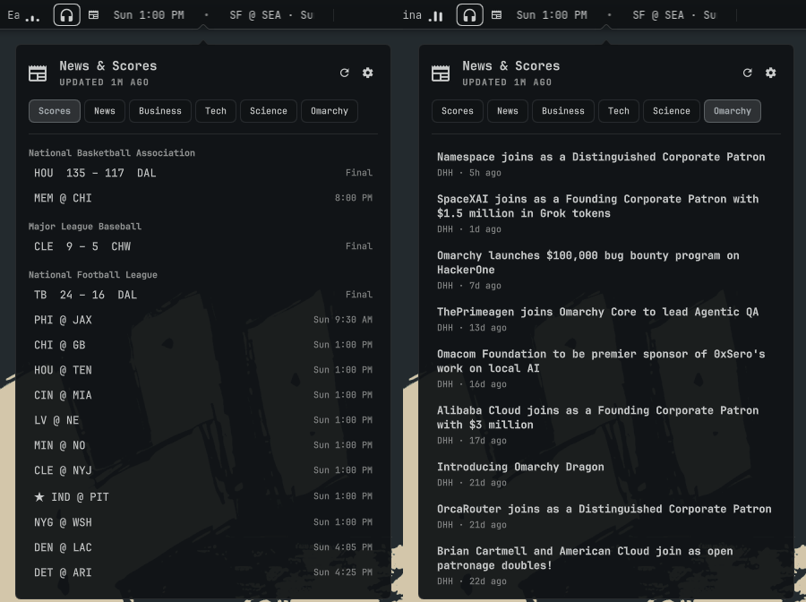

# News & Scores for Omarchy

A bar widget for the [Omarchy](https://omarchy.org) shell: a newspaper icon and a
scrolling ticker of live sports scores and headlines, with a popup holding the
full scoreboard, up to five article tabs, and its own settings page.



- **Scores** from ESPN for any leagues you pick (NBA, NFL, MLB, NHL, Premier
  League, Champions League, …), with your favourite teams leading the ticker.
- **Alerts** as desktop notifications for goals, touchdowns, lead changes and
  finals, tuned per sport.
- **Article tabs**, each showing an NYT section, [Omarchy News](https://omarchy.org/news),
  any RSS or Atom feed you give it, or nothing.
- **No API keys or accounts.** Everything comes from public feeds.

## Install

```bash
omarchy plugin add https://github.com/avdrav1/omarchy-news.git --enable
```

This clones the repo into `~/.config/omarchy/plugins/av.news`, validates it, and
places the widget in the bar's left section. To put it somewhere else:

```bash
omarchy bar move av.news --section right
```

Requirements: Omarchy 4.0.4 or newer (release or dev builds), and `python3` on
the `PATH` (the fetch helper uses only the standard library).

### Update

```bash
omarchy plugin update av.news
omarchy restart shell
```

The shell caches compiled QML, so a running widget keeps its old code until the
restart.

### Remove

```bash
omarchy plugin remove av.news
```

This also takes the widget out of the bar and drops its settings. The cache in
`~/.cache/av.news` stays; delete it by hand if you like.

### Troubleshooting

If the widget doesn't show up in the bar:

1. Check that it's enabled and placed: `omarchy plugin list | grep av.news`
   should say `enabled`. If not, run `omarchy plugin enable av.news --section left`.
2. Update and restart: `omarchy plugin update av.news && omarchy restart shell`.
   Versions before 1.4.1 failed to load on release builds of Omarchy.
3. Look for load errors in the shell log:
   `qs log "$(ls -td /run/user/$UID/quickshell/by-id/*/ | head -1)log.qslog" | grep av.news`

## Use

| Input | Action |
|---|---|
| Left click | Open / close the popup |
| Right click | Refresh now |
| Middle click on the ticker | Open the game or article under the pointer |
| Hover | Pause the ticker; the tooltip lists live games |

In the popup: `h`/`l` or `1`–`6` switch tabs, `j`/`k` move, `Enter` opens,
`r` refreshes, `s` toggles settings, `Tab` moves to the next bar popup, `Esc`
closes.

From scripts or key bindings:

```bash
omarchy-shell av.news toggle      # also: open, close, refresh, settings
omarchy-shell av.news text        # print the ticker text
omarchy-shell av.news tab omarchy # open on a tab: scores, tab1–tab5, or a category a tab shows
```

## Settings

Everything is editable from the popup's settings page (`s`). Settings live on
the widget's entry in `~/.config/omarchy/shell.json`, so they can also be set
from the command line:

```bash
omarchy bar set av.news leagues "football/nfl,hockey/nhl"
omarchy bar set av.news teams "KC,BOS"
omarchy bar set av.news tab2 custom
omarchy bar set av.news tab2Url https://hnrss.org/frontpage
omarchy bar set av.news showScores false --json   # booleans need --json
```

| Key | Default | Meaning |
|---|---|---|
| `showScores` | `true` | `false` hides the Scores tab and the ticker's games, and stops score fetches and alerts |
| `leagues` | `soccer/eng.1,basketball/nba` | ESPN `sport/league` paths, comma-separated. Examples: `football/nfl`, `hockey/nhl`, `baseball/mlb`, `soccer/esp.1`, `soccer/uefa.champions` |
| `teams` | `""` | Favourite teams by abbreviation or name (`ARS`, `Golden State Warriors`); they lead the ticker and drive alerts |
| `alerts` | `favorites` | `off`, `favorites`, or `all` |
| `hourCycle` | `12` | `12` or `24` for kickoff times |
| `tab1`–`tab5` | `news`, `business`, `technology`, `science`, `world` | What each article tab shows. NYT sections: `news` (Top Stories), `business`, `technology`, `science`, `world`, `politics`, `health`, `climate`, `arts`. Also `omarchy` (Omarchy News), `custom`, or `off` |
| `tab1Url`–`tab5Url` | `""` | RSS or Atom URL for a `custom` tab. The tab takes its label from the feed's title |
| `tickerSources` | `scores,tab1` | What scrolls in the ticker: any of `scores`, `tab1`–`tab5`, comma-separated. With nothing selected the ticker hides and only the icon shows |
| `tickerTeams` | `favorites` | `favorites` shows only your teams' games while any of them has one on (live, final in the last 12 h, or within 7 days), and every game otherwise. `all` always shows every game |
| `tickerWidth` | `240` | Ticker width in px. It stays fixed so the bar layout doesn't shift |
| `tickerSpeed` | `40` | Scroll speed in px/s |
| `displayMode` | `full` | `full` (icon and ticker), `icon`, or `text` |

## Alerts

Alerts are sent with `omarchy-notification-send`:

- **Soccer, hockey:** every goal
- **American football:** touchdowns and field goals (the extra point or
  two-point try is included with the touchdown)
- **Baseball:** lead changes and ties, not every run
- **Basketball:** the final only, since it scores too often for anything else
- **Every sport:** the final score

Games seen for the first time never alert, so a cold cache or a newly added
league stays quiet.

## How it works

`bin/av-news-fetch` (Python, standard library only) does all the fetching and
writes `~/.cache/av.news/feed.json` atomically. The widget runs it every 15 s
from each monitor. A lock and the cache age make all but one of those runs a
no-op, so a multi-monitor setup fetches and alerts once.

- Scores refresh every 30 s while a game is live or about to start, and every
  5 min otherwise.
- Article feeds refresh every 15 min, and at once when a tab's feed changes.
- A league or feed that fails keeps its last good data. A failed feed is
  retried a minute later.

Network requests go only to ESPN's scoreboard API (`site.api.espn.com`), the
feeds your tabs point at (`rss.nytimes.com`, `omarchy.org`, or your custom
URLs), and the article thumbnails those feeds link to. Nothing is sent anywhere
else.

## Development

```bash
python3 -m unittest discover -s tests     # helper tests (fixtures, no network)
bin/av-news-fetch --force --notify-cmd "" --cache-dir /tmp/av-news \
  --feed tab1=https://rss.nytimes.com/services/xml/rss/nyt/HomePage.xml   # one live fetch
./install.sh --enable                     # copy the working tree into ~/.config/omarchy/plugins/av.news
omarchy restart shell
```

`install.sh` overwrites a git-managed install. Use it only on a development
machine, and run `git -C ~/.config/omarchy/plugins/av.news checkout .` before
the next `omarchy plugin update`.

## Disclaimer

Not affiliated with ESPN, The New York Times, or Omarchy. ESPN's scoreboard
endpoint is public but undocumented and may change without notice. Headlines
and images belong to their publishers. The widget only links to them.

## License

MIT. See [LICENSE](LICENSE).
